# spartamarket_DRF

#ERD
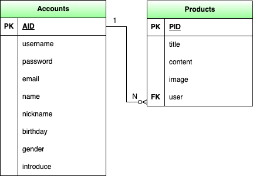

# 프로젝트 소개
스파르타 마켓을 DRF로 구현

# 김나현A 개인과제 

# 프로젝트 주요기능
accounts
- 회원가입
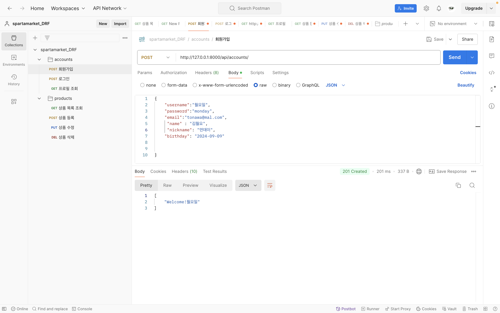
- 로그인
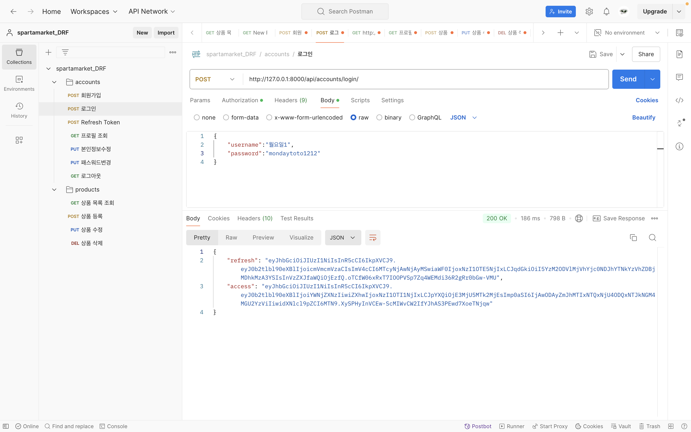
- 프로필 조회
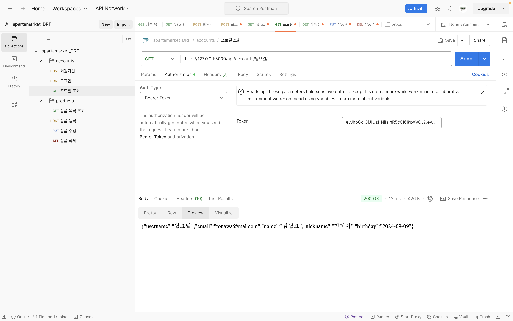

- 로그아웃
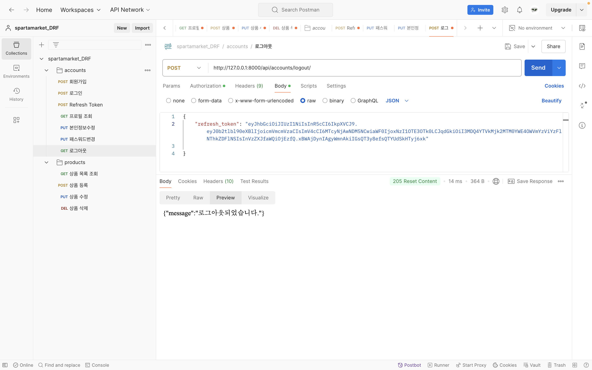
- 본인 정보 수정
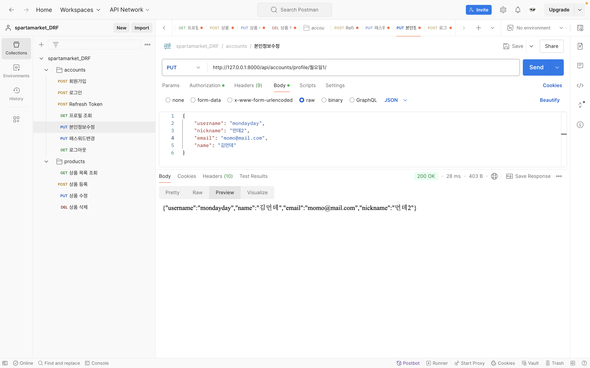
- 패스워드 변경
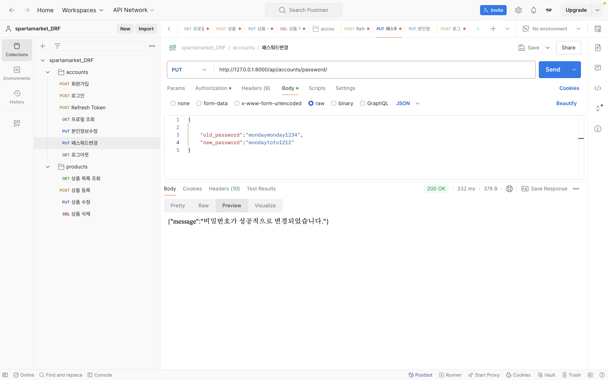
-회원 탈퇴
![ERD] (static/delete.png)
![ERD] (static/delete2.png)
products
- 상품 등록
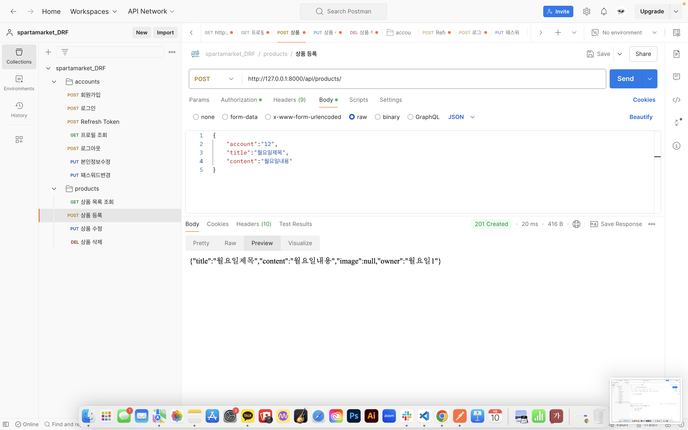
- 상품 목록 조회
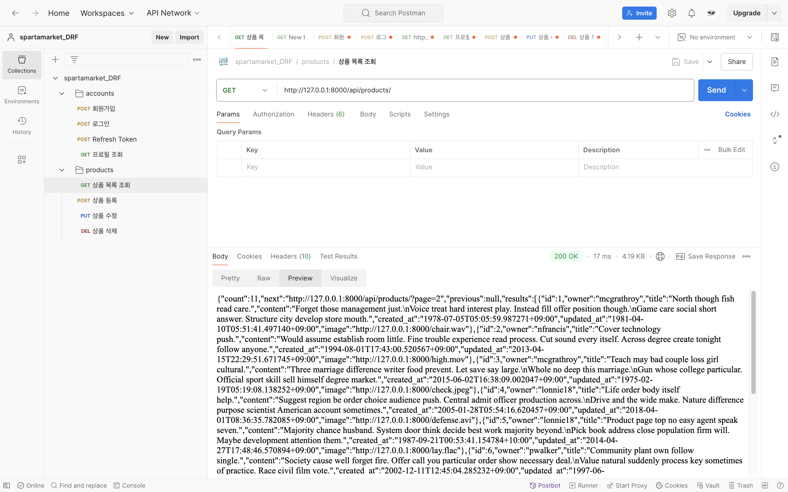
- 상품 수정
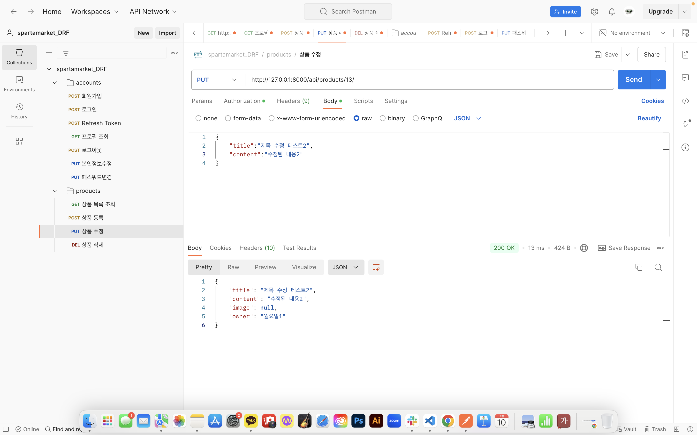
- 상품 삭제
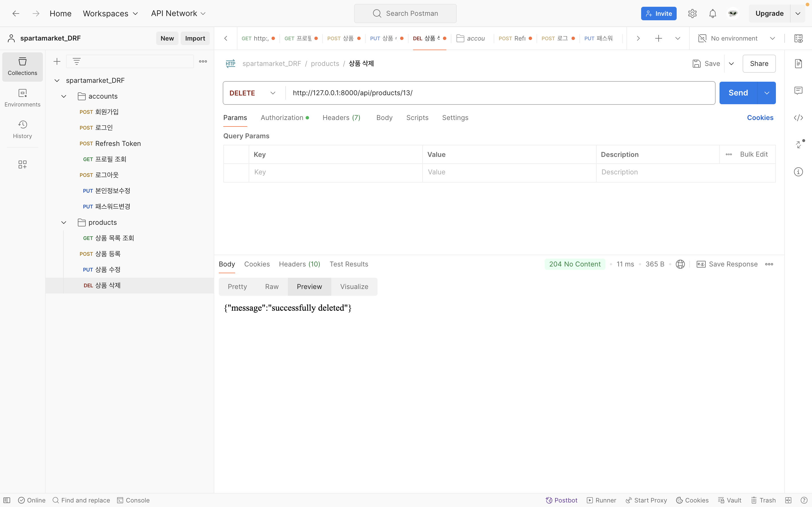
